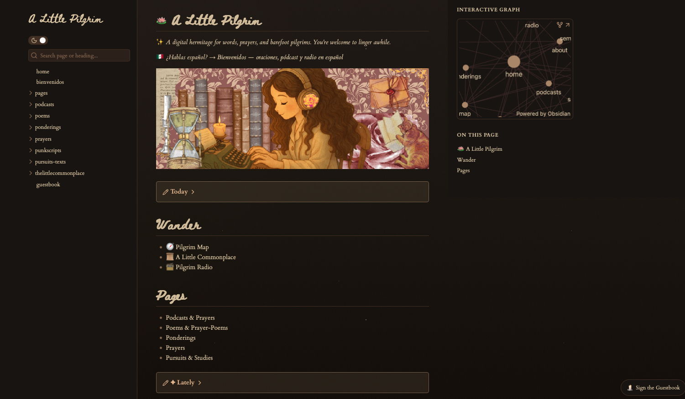
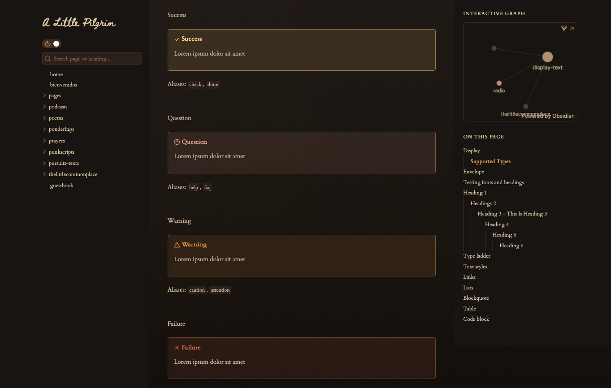
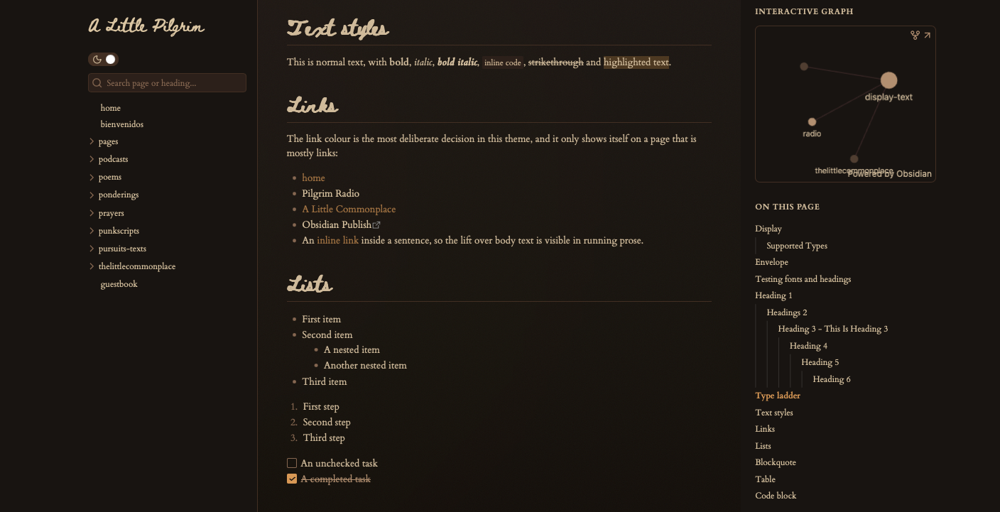
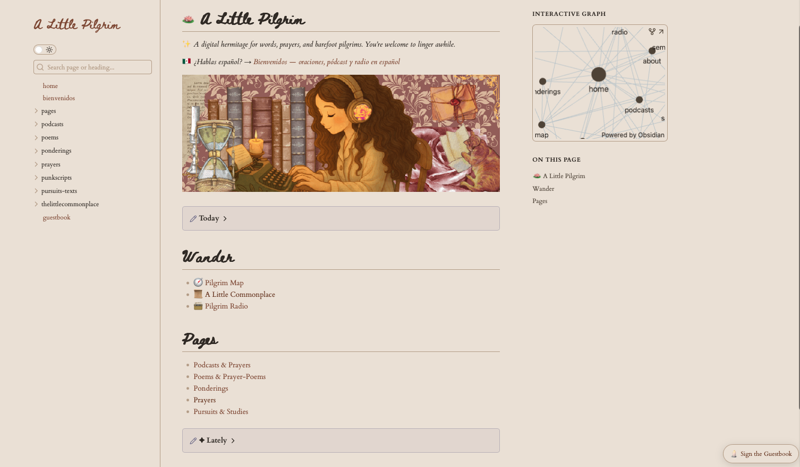
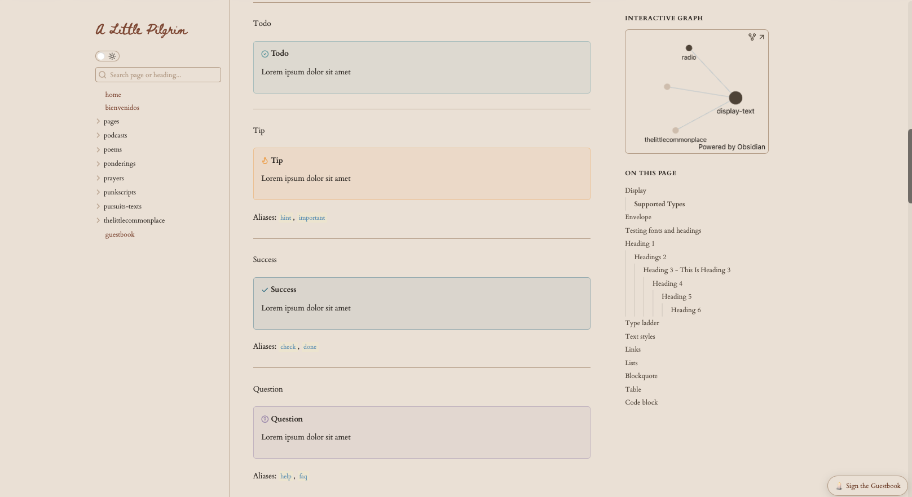

# Obsidian Publish — Impressionist / Typewriter Theme

A warm, book-like CSS theme for **Obsidian Publish**, with **two complete moods**:

- **Light — aged parchment.** Cream ground, walnut-brown ink and links.
- **Dark — candlelit library.** A deep-walnut ground under a slow-drifting amber
  glow, cream text, candle-amber accents, and an optional field of stars.

Serif body type (`Cardo`), hand-drawn headings (`Beth Ellen`).

You can see it in action at **alittlepilgrim.org**.

---

## What's new in this version

The previous release was light-only — its dark mode simply re-served the light
palette. This version adds a real one:

- **A true dark mode**, the "candlelit library" palette, with its own link,
  callout, sidebar and nav rules rather than a recolour of the light theme.
- **The candlelight gradient** — a layered dark ground: a walnut ramp, a large
  blurred amber glow that drifts across ~70 seconds, and a 5% SVG noise layer
  that suppresses the banding a soft gradient would otherwise show.
- **A starfield**, twinkling on two offset timers, scoped to the home page.
- **A warm callout ramp** — every callout type mapped onto one gradient from
  dusky rose through terracotta and amber to parchment, with a catch-all so an
  unlisted callout type can never fall back to Obsidian's stock blue.
- **Unified sidebars** — the file explorer and "on this page" outline are drawn
  by Publish's own tree variables, not the link rules, so they are painted here
  to match the content and to agree on how "you are here" looks.
- **Type-ladder utilities** — `.alp-overline`, `.alp-lede`, `.alp-signature`.
- Full `prefers-reduced-motion` support: the glow and the stars both stop.

---

## Screenshots

### Dark mode — the candlelit library

The callout ramp, warm from end to end — honey, rose-clay, bronze, terracotta:

Links read in one cream, a whisper above body text, with gold held back for hover:

### Light mode — aged parchment

---

## Install

1. Download `publish.css` (or `obsidian-publish-css-impressionist.css` and
   rename it to `publish.css` — they are the same file).
2. Save it in the **root folder** of your Obsidian Publish vault.
3. Publish. Obsidian applies it automatically.

There is no staging step — it goes live the moment you publish.

---

## Two things that will catch you out

**1. The night-sky block overrides the token layer.** The dark background is
painted by a rule with `!important` near the bottom of the file, *not* by
`--color-background-dark`. To change the dark ground you must edit both, or
nothing will appear to happen.

**2. No cool tones.** Every colour here is warm. If you drop a blue or a
blue-grey into a token it will show up in more places than you expect —
`--color-foam-dark` alone drives visited links, which paints the whole sidebar
nav, the site title and the footer.

---

## Optional pieces

| Feature | How to use it |
| --- | --- |
| **Stars** | Scoped to `body.alp-home`, a class added on the home page via `publish.js`. Drop `.alp-home` from the two selectors for stars everywhere, or swap in your own body class. |
| **Centered logo** | Give an image the alt text `logo`: `` |
| **Text over an image** | Wrap in `.image-container` with a `.image-text-overlay` span. |
| **Responsive Google Form** | Wrap the iframe in `.responsive-gform-container` and set `padding-top` to your form's aspect ratio. |
| **Featured quote** | A `[!quote]` callout gets a rose halo in dark mode. Delete that block for uniform callouts. |
| **Publish footer** | The "Published with Obsidian Publish" credit is hidden. Delete that rule to keep it. |

---

## Style Settings

If you use the **Style Settings** plugin in your local vault, this theme
includes optional toggles for:

- Faded markdown formatting (`shrink-formatting`)
- Active line highlighting (`active-line-highlight`)

These affect the editing view in the local app only, not the published site.

---

## License

[MIT License](LICENSE) — originally based on the Impressionist theme.

Feel free to fork, remix, and share.
